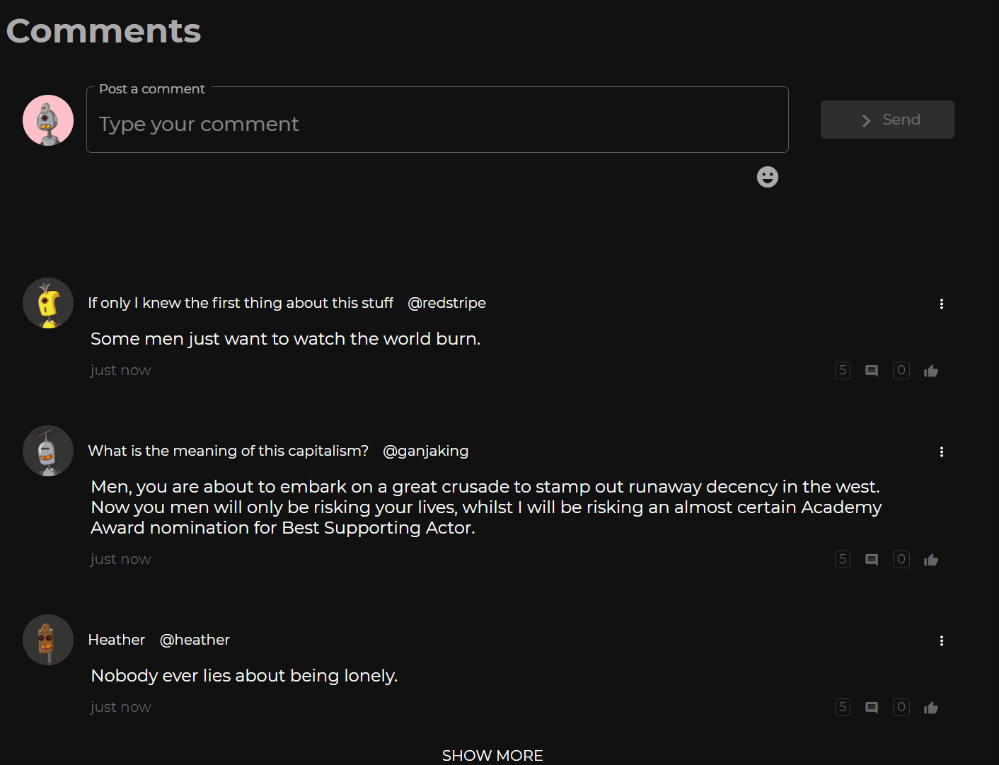

# @/banta
> **⚠ Beta** | [🌐 Website](http://bantachat.com/) | [📦 NPM](https://npmjs.com/package/@banta/sdk)

Banta is an effort to create an open, extensible system for chatting/comments on the web.

- Real-time: Live-updating comments & chat widgets
    * Both the Banta Comments and Banta Chat widgets are fully live updated via WebSockets.
    * When running in an environment where WebSockets are not appropriate, a REST call is used to fetch messages 
      instead (ie in SSR or Search Engine index bots such as Googlebot)
- Easy to use: Easy to add to an existing Angular application, easy to manage server-side component.
- Flexible: Built with customizability and extension in mind



[Try it out](https://bantachat.com/try)

## Features

- Simple addressing of conversations by alphanumeric topic identifiers
- Replies / threading (single layer)
- Likes
- Social sharing
- Editable/deletable messages
- Emojis
- Efficient message counters for related UIs
- Pluggable authentication and permission checks
- Pluggable message transformation (ie editing out specific words as a comment/chat message is posted)

## Components

`packages/`
- `common/` -- @banta/common: Code common to both frontend & server
- `frontend/` -- @banta/frontend: Banta website & Angular SDK
    - `projects/sdk` -- @banta/sdk: Contains the client SDK for Angular
- `server/` -- @banta/server: Banta server

# Dependencies

- Frontend: Angular 11+ (latest version recommended)
- Server
    * MongoDB
    * Redis

# Development

First, make sure to install MongoDB and Redis and have them running on your machine. Then:

```shell
npm install
lerna run build

cd packages/frontend && npm run build:lib && npm start  # start the Angular application & SDK cradle
cd packages/server && npm start    # start the server application
```

## Live developing SDK within external apps 

> Warning: This workflow is rather flaky.

If you wish to use `npm link` to work on the SDK from within the context of your own app, you will need to do:

```shell
# In banta project:
cd packages/frontend
npm run build:lib
cd dist/sdk             # IMPORTANT!
npm run start:lib       # will rebuild the SDK package whenever it changes

# In your app project:
npm link @banta/sdk
npm start               # will rebuild your project whenever the SDK changes
```
